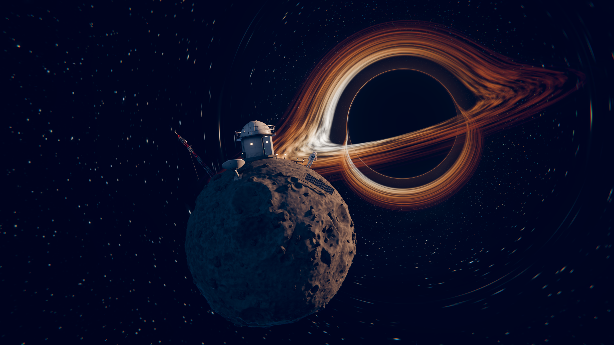

# The Last Observatory

A tiny scientific outpost on an impossibly small planet (radius 9 m) orbiting
close to a black hole. One astronaut stands on the planet's edge, looking out
at the accretion disk.



* **Final still:** `renders/the_last_observatory_still.png` (2560×1440)
* **Animation:** `renders/the_last_observatory.mp4` (6 s, 24 fps, 1280×720, H.264).
  It starts close on the astronaut's helmet and pulls back to reveal the whole planet.
* **Scene:** `the_last_observatory.blend` (Blender 5.2, Cycles + OSL)

Everything is generated from Python (`scripts/`). There are no downloaded
assets or image textures: every material is procedural, and the terrain and
rock field are Geometry Nodes systems that stay editable in the `.blend`.

## What's in the scene

| Element | How it is made |
|---|---|
| **Black hole + accretion disk** | `shaders/black_hole_sky.osl`, an OSL world shader that ray-marches each camera ray backwards through Schwarzschild spacetime (photon orbits via the `a = -1.5 h² r̂ / r⁴` formulation). It captures the lensed far side of the disk over and under the shadow, the photon ring, the Einstein-ring distortion of the star field, Keplerian differential rotation (animated), relativistic Doppler beaming and gravitational redshift. Rays far from the hole use the analytic weak-field deflection of the same force law, so the lensed sky has no seam. |
| **Sky** | A procedural 3-layer star field and a faint galactic band with dust lanes, both lensed. |
| **Planet** | Geometry Nodes on an icosphere (≈330k faces): two noise layers of macro undulation, ridged detail, three scales of craters (Voronoi-cell bowls with raised rims, per-cell random size), a levelled observatory pad, a softened footpath and a smoothed spot where the astronaut stands. Crater floor/rim masks are stored as attributes that drive the regolith shading. |
| **Regolith** | Procedural albedo (macro/mid/fine mottling, dark crater floors, bright ejecta), pebble and grain bumps, and **procedural boot prints** trodden from the observatory door to the astronaut. |
| **Rocks** | 9 rock prototypes from a `RockGen` node group (noise and Chebychev-Voronoi facets, flattened bases). A `RockScatter` node group Poisson-scatters rocks, boulders and pebbles on the planet, with keep-out zones around every structure and path. Rocks get upward-facing dust in their shader. |
| **Observatory** | Panelled drum (seams, rivets, per-panel tint, paint chips, creeping dust), an open door (boolean-cut) with a lit interior (console with animated-looking scope screens, rack LEDs), glowing portholes, a catwalk with railing, a ladder, a dome with a boolean slit and slid-back shutter, and a telescope aimed at the black hole under dim red observing light. |
| **Antenna equipment** | 5.9 m triangular lattice mast in aviation stripes with guy wires, panel antennas, a Yagi aimed at the hole, and **blinking red beacons** (animated). A parabolic dish with feed struts and back truss. A solar array. |
| **Lights** | Path bollards along the footprints, door lamp, interior and dome lights, beacon lights, suit LEDs, helmet lamps. |
| **Astronaut** | Metaball EVA suit (pillowy, blended joints; knee and elbow accordion pleats in the shader), hard-shell hood with a gold reflective visor, neck and wrist rings, commander stripes, backpack with vents, chest control module with status LEDs, gloves, boots and hoses, and a handheld tablet. The figure is seated on the terrain by ray-casts under each boot. |

## Lighting and look

* **Key:** a warm sun standing in for the inner accretion disk. It is cheated towards
  camera-right so the planet shows a readable crescent. A broad, redder secondary
  sun stands in for the outer disk glow.
* **Fill:** cold "starlight" from camera-left, plus a cool under-rim that keeps the
  planet's silhouette.
* **Night side:** the camera sees the planet's night side, lit by warm practicals
  (windows, open door, path lights) against the cool fill.
* **Grade:** AgX (Medium High Contrast), with compositor bloom, subtle lens
  dispersion, a vignette and a lift/gain grade (cool shadows, warm highlights).

## Camera move

The camera is baked per frame (`scripts/lastobs/camera.py`):

* It starts over the astronaut's right shoulder: helmet on the left, black hole on the right.
* It dollies back in **log space**, so the frame expands at a steady rate instead of lurching.
* It swings behind the figure, and the look target drifts from the helmet to the final framing.
* It **rolls from the astronaut's local vertical to world up**, so the horizon tilts away
  as the planet's curvature is revealed.
* A slight focal-length push (30 → 36 mm) makes the hole loom as we retreat.
* Depth of field tracks the helmet, and camera motion blur is on.

The whole layout is derived from the final framing (`scripts/lastobs/layout.py`).
The black hole direction is solved so it lands upper-right of the last frame, and
every site on the planet is placed relative to that camera.

## Rebuild / render

Blender 5.2 as a Python module (`pip install bpy==5.2.2`, Python 3.13) or a
regular Blender 5.2 install:

```bash
# build the .blend from scratch (≈10 s)
python scripts/build_scene.py -- --out the_last_observatory.blend
# hero still (last frame, 2560x1440)
python scripts/render_still.py -- --res 2560x1440 --spp 384
# animation: PNG frames to renders/frames, then MP4 (needs ffmpeg or imageio-ffmpeg)
python scripts/render_animation.py -- --res 1280x720 --spp 32
```

With the Blender app: `blender -b -P scripts/build_scene.py -- --out …`, then
open the file. **Rendering requires Cycles with Open Shading Language enabled
(CPU)**; the file already has it set. With OSL off, the black hole sky cannot render.

## Layout

```
shaders/black_hole_sky.osl   lensing sky shader
scripts/build_scene.py       builds + saves the scene
scripts/render_still.py      hero still
scripts/render_animation.py  frames + MP4
scripts/lastobs/
    layout.py      composition-first layout (camera, black hole direction, sites)
    sky.py         world / OSL wiring, disk rotation clock
    planet.py      terrain + rock Geometry Nodes, regolith with footprints
    props.py       observatory, mast, dish, solar array, crates, lamps, cables
    astronaut.py   the astronaut
    materials.py   procedural material library
    lighting.py    key / fill / rim
    camera.py      the baked pull-back
    render.py      Cycles, colour management, compositor
    util.py        node / bmesh helpers
```
